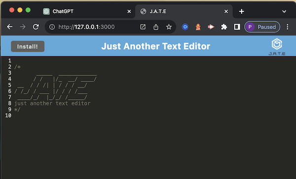

## ProgressiveWebApp  

# Description
    - This project was created in order to have a better understanding of how Progressive Web Apps work. This PWA allows the user to have an app experience while still viewing on the web as well as the ability to download the app to use while off-line. The use of this app gives an understanding of how cache works and how it can improve the web app in speeding up how quickly you can view the app and still view your own inputs.
    - Highlights of learning include - Service Workers, Web App Manifest, Responsive Design and Cache API.
    - PWA allows apps to load quickly, serving cached content while the device is not connected to the internet.
    - PWAs combine the best features of web and mobile apps, providing reliable and fast usage that works amoungst different devices. They offer off-line functionality, with an app-like feeling while interacting.  

## &nbsp;&nbsp;&nbsp;  Installation  
    after downloading repository, run npm i, npm run start, once it is running, open url and open on port. From there it can be run or installed.

## &nbsp;&nbsp;&nbsp;  Usage  
    See diagrams to show how it should looking running on line as well as running offline.  
Online:  
  
  
Offline:  

## &nbsp;&nbsp;&nbsp;  Contributing  
    Assitance was given thru AskBCS Learning Assistants and reference to the exercises and mini-project shown in class.

## &nbsp;&nbsp;&nbsp;  Tests  
    

# Table of Contents
- [Installation](#installation)
- [Usage](#usage)
- [License](#license)
- [Contributing](#contributing)
- [Questions](#questions)

# License
The MIT License  https://opensource.org/licenses/MIT

# Questions
please contact me with any questions:  
GitHub: https://github.com/PamWillis  
Email: pwillisop@yahoo.com
